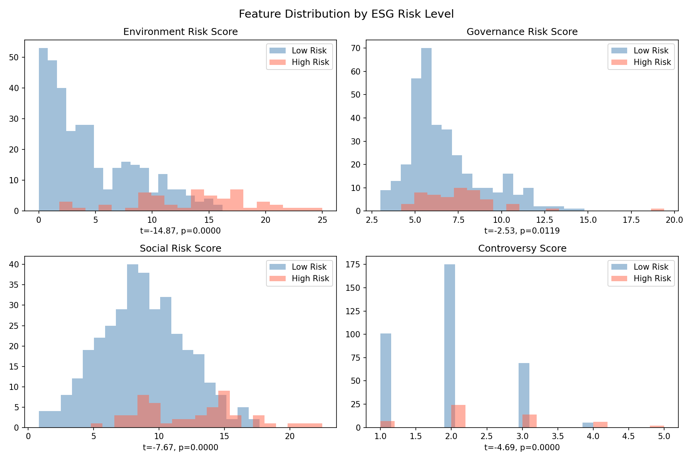
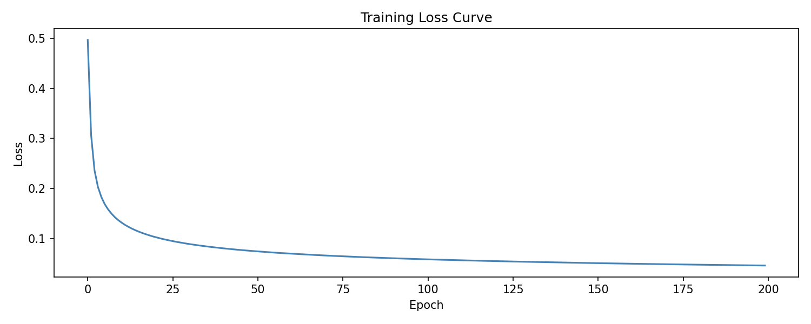
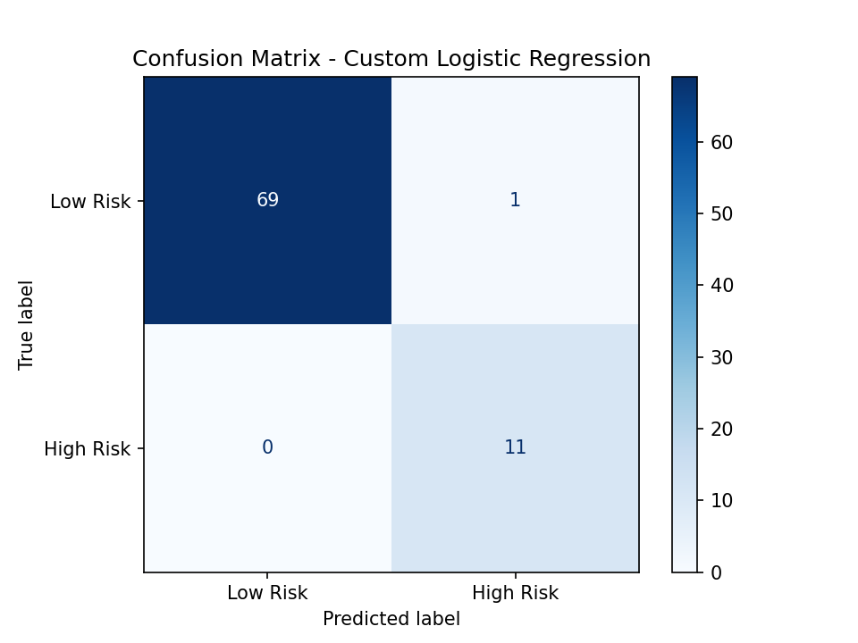
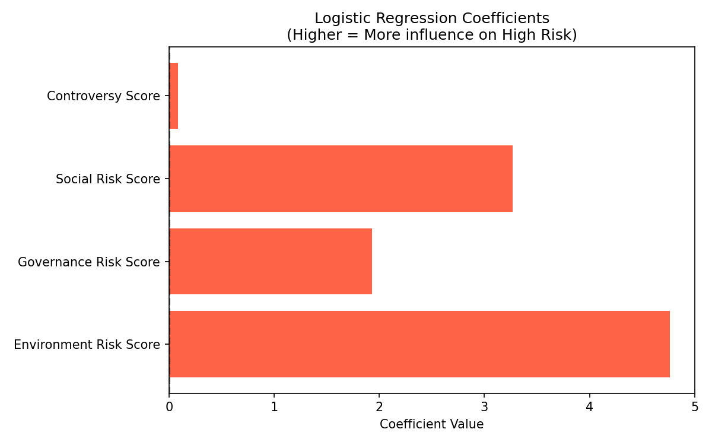
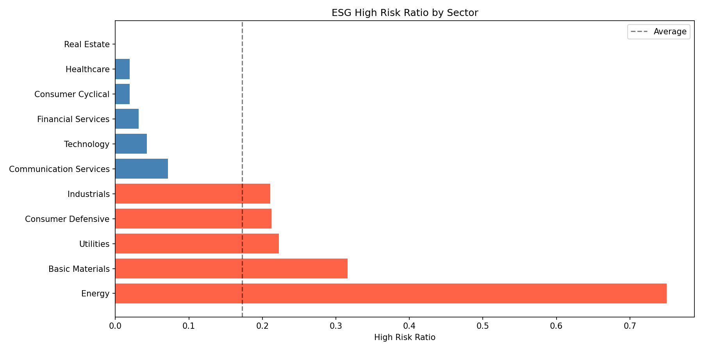
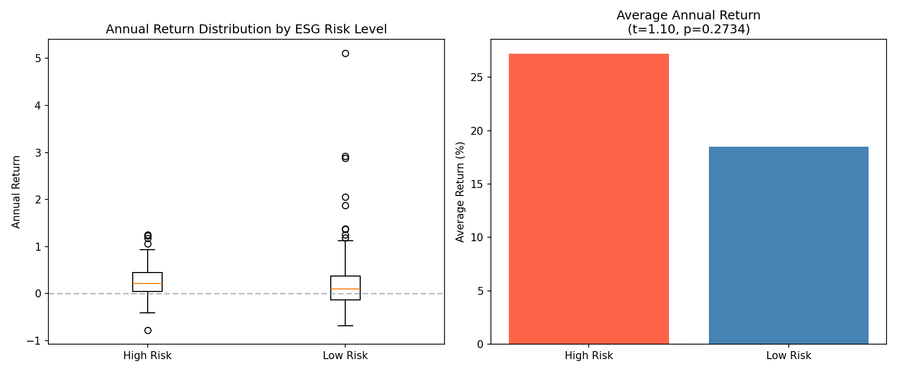

# ESG Risk Classification: S&P 500
**Predicting High-Risk Companies Using Logistic Regression — From Scratch**

---

## Project Overview

This project classifies S&P 500 companies into ESG high-risk vs low-risk groups using a **logistic regression model implemented from scratch**, based on principles learned in class.

The model uses Environment, Governance, Social, and Controversy scores to predict whether a company is an ESG high-risk entity — directly applicable to ESG-based investment strategies covered in CFA curriculum.

---

## Data

- **Source**: Kaggle — S&P 500 ESG Risk Ratings
- **Target**: ESG Risk Level → High/Severe = High Risk (1) / Others = Low Risk (0)
- **Final Dataset**: 403 companies (High Risk: 53 / Low Risk: 350)
- **Train/Test Split**: 80/20 with `stratify=Y` to preserve class ratio

| Split | Size | High Risk Ratio |
|-------|------|----------------|
| Train | 322  | 13.0% |
| Test  | 81   | 13.6% |

---

## Statistical Analysis (t-test)

Before modeling, I verified that all features show **statistically significant differences** between risk groups.

| Feature | t-statistic | p-value | Significant? |
|---------|------------|---------|--------------|
| Environment Risk Score | -14.87 | 0.0000 | ✅ |
| Social Risk Score | -7.67 | 0.0000 | ✅ |
| Governance Risk Score | -2.53 | 0.0119 | ✅ |
| Controversy Score | -4.69 | 0.0000 | ✅ |

All 4 features are statistically significant at α=0.05.



---

## Methodology

### Logistic Regression — Implemented from Scratch

**Core Formula:**
```
P(Y=1 | X) = sigmoid(w^T * x + b) = 1 / (1 + exp(-(w^T * x + b)))
```

**Loss Function — Binary Cross Entropy:**
```
Loss = -y * log(ŷ) - (1-y) * log(1-ŷ)
```

**Gradient:**
```
∂Loss/∂w = (ŷ - y) * x
∂Loss/∂b = (ŷ - y)
```

**SGD Update:**
```
w ← w - η * ∂Loss/∂w
b ← b - η * ∂Loss/∂b
```

**Preprocessing:**
- StandardScaler applied (mean=0, std=1) — essential because variables have different scales
- stratify=Y in train/test split to preserve class imbalance ratio

**Hyperparameters:**
- Learning rate (η): 0.01
- Epochs: 200
- Batch size: 1 (SGD)

---

## Results

### Model Performance

| Model | Test Accuracy | High Risk Recall | High Risk F1 |
|-------|--------------|-----------------|--------------|
| Custom Logistic Regression | **0.99** | **1.00** | **0.96** |
| sklearn LogisticRegression | 0.99 | 1.00 | 0.96 |

Custom implementation matches sklearn — confirming correctness of the from-scratch implementation.

**Key Insight**: High Risk Recall = 1.00 → All 11 high-risk companies correctly identified (0 False Negatives). In ESG risk screening, missing a high-risk company is more costly than a false alarm.

### Training Loss Curve


### Confusion Matrix


---

## Feature Importance (Coefficients)

| Feature | Coefficient | Interpretation |
|---------|------------|----------------|
| Environment Risk Score | **4.7638** | Strongest predictor |
| Social Risk Score | **3.2712** | 2nd most important |
| Governance Risk Score | **1.9314** | 3rd most important |
| Controversy Score | **0.0858** | Minimal impact |

**Key Finding**: Environment score is the dominant predictor — consistent with the growing emphasis on climate risk in ESG investing (aligned with CFA ESG curriculum).



---

## Sector Analysis

| Sector | High Risk Ratio |
|--------|----------------|
| Energy | 75.0% |
| Basic Materials | 31.6% |
| Utilities | 22.2% |
| Consumer Defensive | 21.2% |
| Industrials | 21.1% |
| Technology | 4.3% |
| Real Estate | 0.0% |

Energy and Basic Materials sectors show the highest ESG risk — aligning with their heavy environmental footprints.



---

## Limitations

- Small dataset (403 companies) — results may not generalize
- Class imbalance (High Risk: 13%) — handled via stratified split, but SMOTE could further improve
- Static snapshot — ESG scores change over time; time-series modeling would be more robust
- Binary classification simplifies a multi-level risk structure

---
## Step 12. ESG Risk & Stock Performance Analysis

### Hypothesis
> "Companies with high ESG risk show lower annual stock returns compared to low ESG risk companies."

### Data
- Stock return data fetched via **yfinance**
- Period: 2 years (to align with ESG rating measurement timepoint)
- Delisted companies excluded

### Results

| | High Risk | Low Risk |
|--|--|--|
| Companies | 51 | 336 |
| Average 2Y Return | **27.19%** | **18.47%** |
| Difference | +8.72%p | |
| t-statistic | 1.0967 | |
| p-value | 0.2734 | |
| Statistically Significant | No (p > 0.05) | |

### Key Finding
The hypothesis is **rejected**. High ESG risk companies actually showed higher returns (27.19% vs 18.47%), but the difference is **not statistically significant** (p=0.2734).

This aligns with growing academic debate around ESG investing — the assumption that "better ESG = better returns" is not clearly supported by this data.

### Interpretation
- ESG risk scores alone may not predict stock performance
- Short-term market returns may be driven by factors beyond ESG (sector trends, macro environment)
- Energy sector (highest ESG risk: 75%) benefited from commodity price increases, potentially inflating High Risk returns

### Limitations
- ESG rating timepoint not precisely known — 2Y return used as approximation
- Sample imbalance: 51 High Risk vs 336 Low Risk companies
- Single time period analysis — longitudinal study would be more robust



## Tech Stack

- Python, NumPy, Pandas
- scikit-learn (StandardScaler, train_test_split, LogisticRegression for validation)
- SciPy (t-test)
- Matplotlib
- Jupyter Notebook
- 
